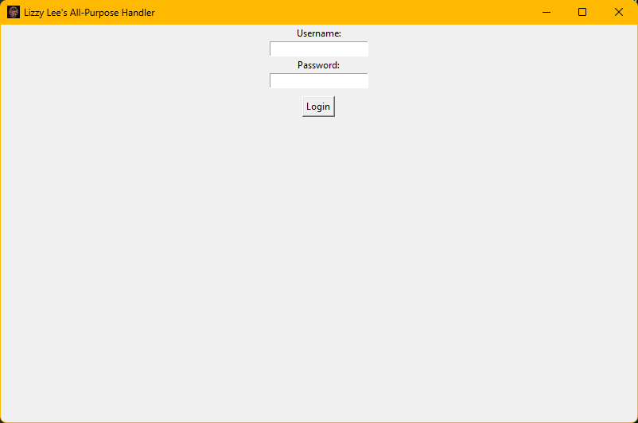
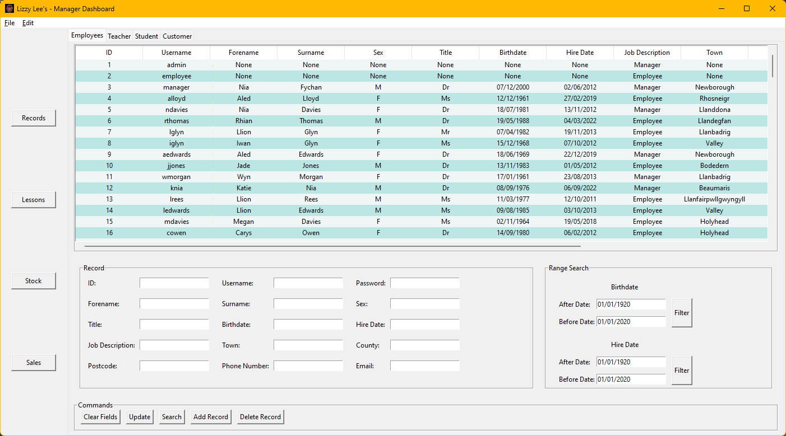
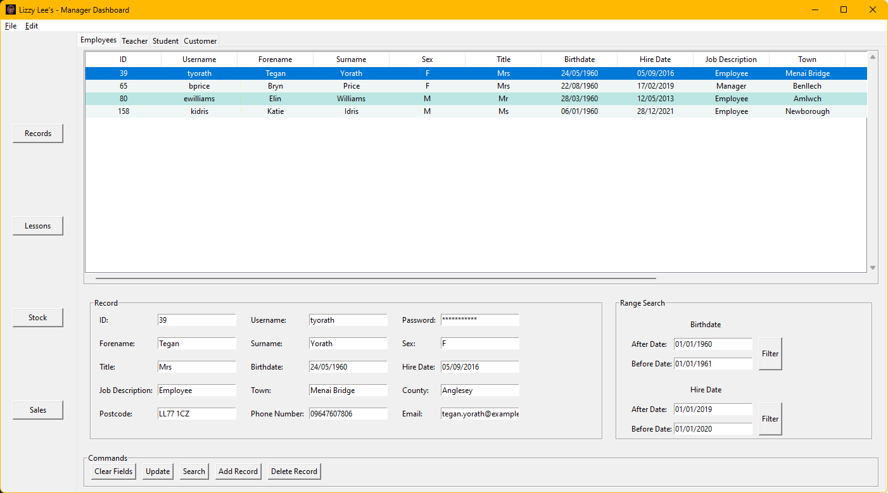

# A Level Computer Science Project

William Gill's submitted project for Unit 5 WJEC A Level Computer Science.

## Project Description

The project was a proposed upgrade for a company called Lizzy Lee's Rock Cafe that aimed to upgrade their paper based system to a digital solution that could be used by the company to manage their stock, staff, customers, and students as well as lesson bookings.

The submission includes a [315 page pdf writeup](SUBMISSION.pdf) (originally created in Google Docs) that contains sub-documents for each stage of development:

* Discussion
* Investigation
* Design
* Prototype
* Post-Prototype Design Refinement
* Software Development
* Developmental Testing
* Testing
* Evaluation

According to my teacher I achieved the highest grade he had ever seen for a project submission, and I was awarded an 85/100 for the project, which is worth 20% of my overall grade.

## Getting Started

### Prerequisites

Our A level spec demanded that if we use Python it would have to only use the standard library, so I used the Tkinter module for the GUI, and SQLite3 for the database.

It also required that we use specifically **Python version 3.4.2** for some mental reason.

Which means that all you need to run the code is [Python version 3.4.2](https://www.python.org/downloads/release/python-342/) which is still far too much to ask.


### Installing

All you need from this repo is the "main.py" file, and the "Lizzy Lees Logo.ico" file. 

*Optionally* you can also download the "EXAMPLE DATABASE" folder to have an example database to use with the program.


## Running the program

Open a command line in the directory containing the files, then run the code with:

```
py -3.4 main.py
```

### Using the program

If you run the program clean, it will display a prompt informing you that the default username and password are "admin" and "admin" respectively.

Otherwise you can use the [example database](EXAMPLE_DATABASE/savedata.lzl) provided in the repo, which has a username of "admin" and a password of "admin" for the admin user, but you can also log into any of the existing user records using the command line log to find their passwords.

The specific usage of the program is documented in the pdf under "Software Development".

## Screenshots






Again, there are more screenshots in the pdf.

## Authors

* **William Gill** - *Everything* - [FREAKS](www.freaks.org.uk)

## Acknowledgments

* Gandalf the Grey
* My dog Woolfie
* Gandalf the White
* Monty Python and the Holy Grail's Black Knight
* Pochita
